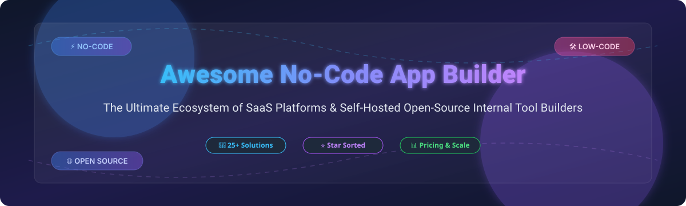

# Awesome No-Code App Builder 🚀

  
  
  
  
  
  

## 🌟 Top No-Code App Builder Ecosystem & Low-Code Platforms

**Curated List of Commercial SaaS Products & Self-Hosted Open-Source GitHub Projects** ⚡  
*Focused on Visual App Development, Internal Tools, Relational Databases & Web/Mobile App Builders.*  

**Last updated: October 2026** 📅

---

### 💡 Overview & Ecosystem Insights
This repository tracks leading **commercial no-code and low-code app builders** and **open-source developer tools**. These platforms allow engineering, operations, and business teams to build custom web/mobile applications, internal admin portals, workflow automations, and enterprise dashboards without manual coding.

---

## 📑 Table of Contents
- [🏢 SaaS / Hosted Platforms](#-saas--hosted-platforms)
- [🔓 Open-Source GitHub Projects](#-open-source-github-projects)
- [🏗️ Architectural Recommendations & Stacks](#%EF%B8%8F-architectural-recommendations--stacks)
- [💖 Support & Sponsorship](#-support--sponsorship)
- [🤝 How to Contribute](#-how-to-contribute)
- [⚠️ Disclaimer](#%EF%B8%8F-disclaimer)
- [⭐ Star History](#-star-history)

---

## 🏢 SaaS / Hosted Platforms

> [!NOTE]  
> **Market Size & Structure**: The global low-code & no-code application development platform market size is estimated at **$32.5 Billion in 2026** (projected to exceed $65 Billion by 2030 at a CAGR of 22.5%). The sector is **moderately fragmented**: hyper-scale enterprise infrastructure providers (Microsoft Power Apps, Google Cloud AppSheet, AWS) dominate enterprise governance and large workspace seats, while agile specialized leaders (Bubble, Airtable, Quickbase) retain dominant footholds in specific web app, relational spreadsheet, and workflow niches.

*Table sorted by company size (Revenue / Market Capitalization / Valuation) in descending order:*

| SaaS Product 🛠️ | Description & Best Use Case 🎯 | Company Scale (Revenue / Valuation) 💰 | Starting Paid Tier Pricing 💳 | Free Plan / Free Trial Limits 🎁 |
| :--- | :--- | :--- | :--- | :--- |
| **[Microsoft Power Apps](https://powerapps.microsoft.com/)** | **Microsoft's enterprise low-code platform** — canvas & model-driven apps with Power Platform & Copilot integration. *Best for enterprise Microsoft ecosystem integration.* | **$331.8B** Annual Revenue (Microsoft Corp Parent); Multi-Billion Power Platform segment | **$20/user/month** (Power Apps Premium) | 30-day Free Trial (Power Apps Developer Plan available for community dev) |
| **[AppSheet](https://www.appsheet.com/)** | **Google Cloud's no-code app platform** — build web and mobile apps from spreadsheets and SQL databases. *Best for Google Workspace users.* | **$400B+** Parent Tech Giant (Alphabet Inc. Google Cloud division) | **$5/user/month** (Starter Plan) | Free forever for prototype & testing (up to 10 users) |
| **[Amazon Honeycode](https://www.honeycode.aws/)** | **AWS no-code app builder** — spreadsheet-driven mobile & web apps. *Note: No longer accepting new customers; historically significant AWS product.* | **$600B+** Parent Tech Giant (Amazon.com AWS division) | **$19.99/month** (Plus Tier, up to 20 users) | Free plan included up to 20 users & 2,500 rows per workbook |
| **[Airtable](https://airtable.com/)** | **Leading no-code relational database platform** — views, automations, and interface designer. *Best for relational data apps and operations workflows.* | **$11.7B** Valuation (Series F funding) | **$20/seat/month** (Team Plan, billed annually) | Free forever plan (up to 5 creators, 1,000 records per base, 1GB attachment limit) |
| **[Quickbase](https://www.quickbase.com/)** | **Enterprise no-code platform for business applications** — complex workflow governance & auditability. *Best for enterprise operations & construction/supply chain management.* | **$1.0B+** Valuation (Vista Equity Partners majority stake); ~$215M ARR | **$35/user/month** (Team Plan, minimum 20 seats) | 30-day Free Trial with full features (no free forever tier) |
| **[Caspio](https://www.caspio.com/)** | **No-code database app builder** — scalable online database apps with security compliance (HIPAA, FERPA). *Best for enterprise database-driven apps.* | **$120.7M** Annual Revenue | **$50/month** (Starter Plan) | Free forever plan (includes 50,000 data records, 2 data pages, 100MB storage) |
| **[Bubble](https://bubble.io/)** | **Full-stack visual web app builder** — custom frontend, database, logic engine, and REST API integrations. *Best for SaaS startups & complex client-facing web apps.* | **$100M+** Estimated Valuation ($10m Series A); ~$25M+ ARR | **$29/month** (Starter Plan, billed annually) | Free forever plan (development sandbox, 50,000 workload units, bubble.io subdomain) |
| **[Glide](https://www.glideapps.com/)** | **No-code app builder from spreadsheets & databases** — auto-generated mobile & web apps with modern UI. *Best for internal team mobile apps & field ops.* | **$20M** Total VC Funding raised; ~$42M estimated ARR | **$49/month** (Maker Plan) | Free forever plan (1 published app, 100 data rows, 10 personal users) |
| **[Softr](https://www.softr.io/)** | **No-code web app & portal builder** — turn Airtable or Google Sheets into client portals & internal tools. *Best for client portals, directories, and member communities.* | **$15.7M** Total VC Funding raised ($13.5M Series A) | **$49/month** (Basic Plan, billed annually) | Free forever plan (5 custom domain web apps, 100 internal/external users) |
| **[Noloco](https://noloco.io/)** | **No-code internal tool builder** — instant web apps from Airtable, PostgreSQL, MySQL, and Google Sheets. *Best for customer portals & internal team tools.* | **$5.5M** Total VC Funding raised (Y Combinator backed); ~$1.8M ARR | **$39/month** (Starter Plan) | 14-day Free Trial (no free forever plan available) |

---

## 🔓 Open-Source GitHub Projects

> [!TIP]  
> Self-hosting open-source low-code engines provides complete **data sovereignty**, eliminates vendor lock-in, and bypasses per-seat subscription fees.

*Table sorted by GitHub Stars_Count in descending order:*

| Open-Source Project 🛠️ | GitHub Stars_Count ⭐ | License 📜 | Description & Key Strengths 🎯 | Primary Use Case 💡 |
| :--- | :--- | :--- | :--- | :--- |
| **[Strapi](https://github.com/strapi/strapi)** |  | MIT | **Leading open-source headless CMS & API engine** — fully customizable JavaScript/TypeScript Node.js backend with automated REST and GraphQL API generation. | Headless CMS & Backend APIs |
| **[PocketBase](https://github.com/pocketbase/pocketbase)** |  | MIT | **Open-source backend in 1 single file** — embedded SQLite database with real-time subscriptions, built-in auth, file storage, and admin dashboard. | Lightweight Real-time Backend |
| **[NocoDB](https://github.com/nocodb/nocodb)** |  | AGPL-3.0 | **Most popular open-source Airtable alternative** — transforms any SQL database (PostgreSQL, MySQL, SQLite, SQL Server) into a smart collaborative spreadsheet. | Database Spreadsheet & Airtable Alt |
| **[Payload](https://github.com/payloadcms/payload)** |  | MIT | **Open-source headless CMS & web application framework** — code-first TypeScript architecture with Next.js integration and native GraphQL/REST endpoints. | Developer-centric CMS & App Builder |
| **[Appsmith](https://github.com/appsmithorg/appsmith)** |  | Apache-2.0 | **The leading open-source internal tool builder** — drag-and-drop UI with 45+ pre-built widgets, connecting to any DB/API with custom JS logic. Retool alternative. | Internal Tools & Admin Panels |
| **[ToolJet](https://github.com/ToolJet/ToolJet)** |  | AGPL-3.0 | **Extensible open-source low-code framework for internal tools** — drag-and-drop visual builder with 60+ components, query builders, and enterprise JS/Python plugins. | Internal Tools & Business Apps |
| **[Directus](https://github.com/directus/directus)** |  | BSL-1.1 | **Open-source data platform & headless CMS** — wraps any SQL database with dynamic REST/GraphQL APIs and a granular web admin application. | Headless CMS & SQL Data Platform |
| **[Refine](https://github.com/refinedev/refine)** |  | MIT | **React-based meta-framework for internal tools** — enterprise admin panels, dashboards, and CRUD apps with headless routing, authentication, and data provider hooks. | React Admin Framework |
| **[Budibase](https://github.com/Budibase/budibase)** |  | GPL-3.0 | **Open-source low-code platform for business applications** — fast internal tool creation with built-in database, automation workflows, and self-hosted docker deployment. | Business Apps & Workflow Automation |
| **[Teable](https://github.com/teableio/teable)** |  | AGPL-3.0 | **Hyper-fast real-time no-code database built on PostgreSQL** — high-performance Airtable replacement supporting million-row scale spreadsheet performance. | High-performance Database Spreadsheet |
| **[Grist](https://github.com/gristlabs/grist-core)** |  | Apache-2.0 | **Open-source spreadsheet-database hybrid** — combines spreadsheet formulas (Python support) with full relational database structure and access control. | Spreadsheet-Database Hybrid |
| **[ILLA Cloud](https://github.com/illacloud/illa-builder)** |  | Apache-2.0 | **Open-source low-code builder with AI agent capabilities** — assemble internal tools, charts, and workflows connected to databases and custom LLM prompts. | AI-assisted Internal Tools |
| **[Baserow](https://github.com/baserow/baserow)** |  | MIT/AGPL | **Open-source no-code relational database & page builder** — modular design built with Django and NuxtJS, giving teams full control over user data. | No-Code Database & Portal Builder |
| **[Yeoman](https://github.com/yeoman/yo)** |  | BSD-2-Clause | **Robust scaffolding tool for web applications** — CLI workflow system for rapidly generating project boilerplates and visual app generators. | Web Application Generator Scaffolding |
| **[Corteza](https://github.com/cortezaproject/corteza)** |  | Apache-2.0 | **100% open-source low-code platform & Salesforce alternative** — build record-based business applications, enterprise CRM workflows, and data portals. | Enterprise CRM & Business Platform |
| **[Saltcorn](https://github.com/Saltcorn/saltcorn)** |  | MIT | **Extensible open-source no-code web application builder** — point-and-click UI builder with PostgreSQL database backend, rich plugin system, and theme support. | No-Code Web App Builder |
| **[Openkoda](https://github.com/openkoda/openkoda)** |  | MIT | **Open-source enterprise low-code application platform** — Java & Spring Boot based stack designed for developers needing rapid app scaffolding without lock-in. | Java Enterprise Low-Code |
| **[Joget Workflow](https://github.com/jogetworkflow/jw-community)** |  | Apache-2.0 | **Open-source low-code application platform** — build enterprise web apps, automate business processes (BPM), and manage dynamic forms. | Enterprise Workflow & BPM Apps |
| **[Convertigo](https://github.com/convertigo/convertigo)** |  | AGPL-3.0 | **Full-stack open-source low-code platform for mobile & web** | Cross-Platform Mobile & Web Apps |
| **[Rintagi](https://github.com/Rintagi/Low-Code-Development-Platform)** |  | AGPL-3.0 | **Open-source low-code development platform** | Enterprise Custom Application Development |
| **[OpenXava](https://github.com/openxava/openxava)** |  | LGPL-2.1 | **Java framework for rapid development of enterprise web applications** | Java Web App Framework |
| **[VTJ.PRO](https://github.com/samchen08/vtj.pro)** |  | MIT | **Low-code visual development platform based on Vue 3 and TypeScript** | Vue 3 Visual Frontend Builder |

---

## 🏗️ Architectural Recommendations & Stacks

Combining open-source low-code components creates powerful custom application platforms:
- **Internal Tools & Admin Portals**: Deploy **Appsmith** or **Budibase** for frontend drag-and-drop UIs, backed by **PostgreSQL** or **MongoDB**.
- **Airtable-style Business Databases**: Use **NocoDB** or **Teable** to transform legacy relational databases into modern spreadsheet interfaces.
- **Headless CMS & Content Hubs**: Standardize on **Strapi**, **Directus**, or **Payload** for structured data modeling and instant GraphQL/REST endpoints.
- **Lightweight Micro-Apps & Prototypes**: Utilize **PocketBase** as a single-binary backend for fast MVP iteration.

---

## 💖 Support & Sponsorship

Thank you for visiting this repository! If you find this curated list of no-code app builders helpful for your projects, team workflows, or architectural research, please consider supporting the project:

- ⭐️ **Star this repository** to help others discover it!
- 🍴 **Fork & Share** with fellow developers, creators, and teams.
- ☕ **Sponsor the creator**: Support ongoing maintenance and curated ecosystem updates by buying a coffee via the [GitHub Sponsor Dashboard](https://github.com/sponsors/ishandutta2007).

---

## 🤝 How to Contribute

1. Fork the repository.
2. Add or update entries in `README.md` following the exact table schemas.
3. Ensure starting prices, free tier limits, company valuation/revenue metrics, and exact GitHub Stars_Counts are verified.
4. Submit a Pull Request with a clear description of changes.

---

## ⚠️ Disclaimer

- This is a **community-curated index** for research purposes — not an explicit commercial endorsement.
- **Security & Data Sovereignty**: Self-hosted solutions require security hardening, proper access controls, and compliance monitoring (HIPAA, GDPR, SOC 2).
- **Open-Source Licenses**: Check repository licenses (Apache-2.0, MIT, AGPL-3.0, BSL, GPL-3.0) prior to commercial embedding.

---

## ⭐ Star History

---

  <b>Made for citizen developers, software architects, and engineering teams building modern app ecosystems. 🛠️</b>

